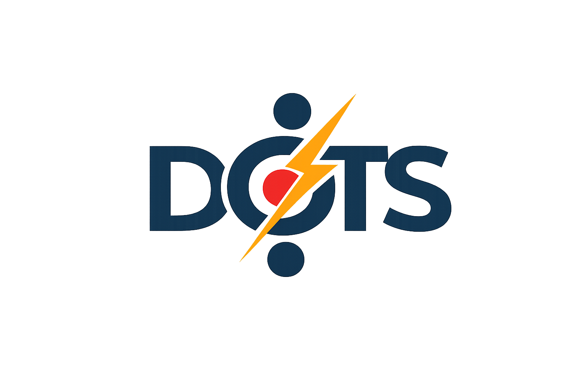

<h1 align="center">
  <br>
  ThunderDots — DTS client for documentary corpora
</h1>

<p align="center">
  <strong>Fast DTS crawling, TEI fragmentation, metadata filtering, validation, and export pipelines.</strong>
</p>

<p align="center">
  <a href="https://github.com/astral-sh/uv">
    
  </a>
  <a href="https://github.com/astral-sh/ruff">
    
  </a>
  <a href="https://github.com/chartes/thunderdots/actions/workflows/ci.yml">
    
  </a>
  <a href="https://github.com/chartes/thunderdots/blob/master/LICENSE.md">
    
  </a>
</p>

---

## Overview

**ThunderDots** is a Python client for [DTS](https://dtsapi.org/specifications/) (*Distributed Text Services*) endpoints, initially built for [DoTS](https://chartes.github.io/dots_documentation/).

It helps you move from a remote DTS API to structured Python objects and JSON records that can feed indexing pipelines, including full-text search, RAG/vector databases, and corpus-analysis workflows.

ThunderDots focuses on practical documentary workflows: crawling DTS collections, fetching TEI/XML resources, extracting reusable text fragments, selecting metadata, validating outputs, and exporting data to downstream search or indexing systems.

---

## What ThunderDots does

ThunderDots can:

- walk DTS collections and subcollections;
- fetch resources and TEI/XML documents;
- extract text fragments from full documents, DTS navigation, or custom TEI XPath rules;
- preserve or filter Dublin Core and extension metadata;
- enrich temporal metadata such as dates and coverage ranges;
- validate generated outputs with JSON Schema;
- export records to indexing pipelines such as Elasticsearch or Qdrant-compatible formats;
- cache fetched corpora as JSON and CSV;
- run synchronous or asynchronous workflows.

---

## Installation

### With `uv`

```bash
uv add thunderdots
```

### With pip

```bash
pip install thunderdots
```

### For development

```bash
git clone https://github.com/chartes/thunderdots.git
cd thunderdots

uv venv
source .venv/bin/activate
uv sync --all-extras --dev
```

or with pip

```bash
python -m venv .venv
source .venv/bin/activate
pip install -e ".[dev]"
```

## Minimal example

```python
from thunderdots import ThunderDots

td = ThunderDots(
    endpoint_dts="https://dots.chartes.psl.eu/api/dts",
    collection_params={"collection_id": "ENCPOS_1900"},
    resource_params={"fragment_mode": "document"},
)

td.fetch()
results = td.results()

print(td.stats())
```

## Development

### Run tests

```bash
pytest
```

Online DTS tests are opt-in:

```bash
RUN_NETWORK_TESTS=1 pytest
```

### Run Ruff (linter, format)

```bash
ruff format --check
ruff check
```

### Build the documentation

```bash
mkdocs build --strict -f mkdocs/mkdocs.yml
```

### License

ThunderDots is distributed under the [MIT License](./LICENSE.md).

### Citation

If you use ThunderDots in academic work, please cite it as:

```
@software{terriel_thunderdots_2026,
  author       = {Terriel, Lucas},
  title        = {ThunderDots},
  year         = {2026},
  publisher    = {GitHub},
  url          = {https://github.com/chartes/thunderdots},
  note         = {Python client for Distributed Text Services endpoints via DoTS}
}
```

You can also use the repository metadata from [CITATION.cff](./CITATION.cff).
